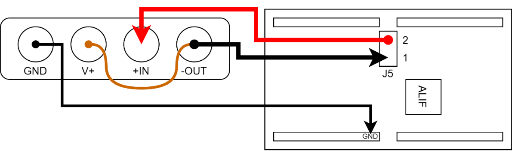
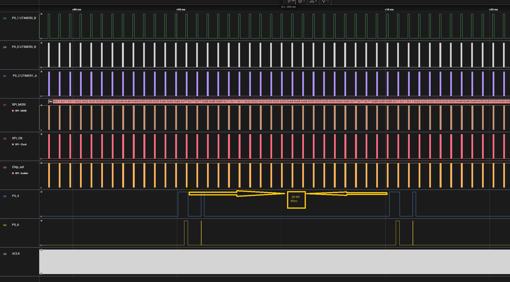
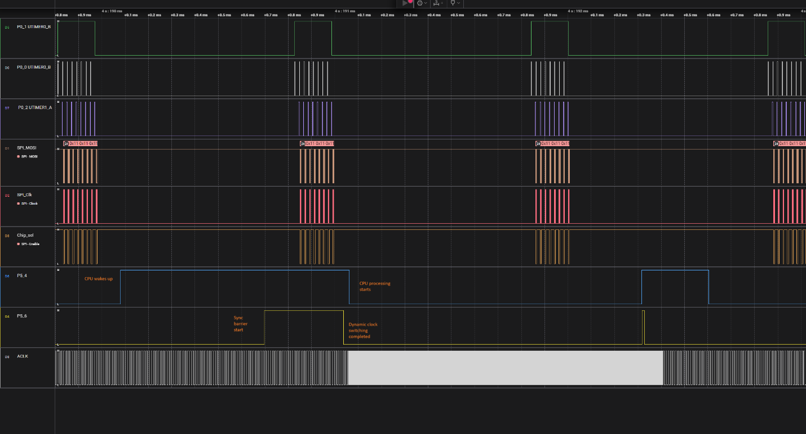
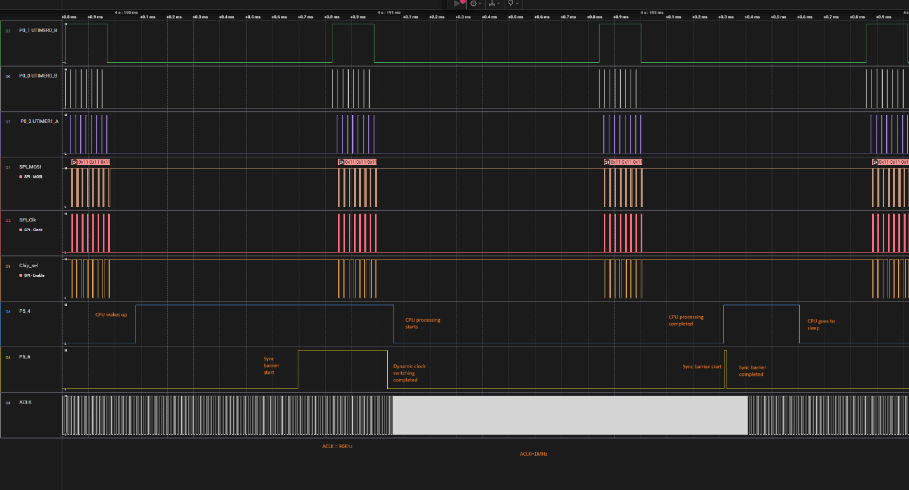

Application Note

**Low Power Sensor Sampling demo**

**Version 1.0**

**  
**

## Introduction:

This is a use-case based low power demo for Alif Ensemble processors.

In this Sensor Sampling use-case, we demonstrate how to continuously capture sensor data from an external SPI ADC at low power. We maximize CPU sleep time by using the DMA peripheral and hardware event routing to drive SPI xfers without CPU interaction. We also demonstrate a dynamic clock scaling scheme which optimizes the power drawing based on application need by switching system clocks between low frequency HFXO and high frequency PLL sources. At low clocks, the DMA can continuously capture sensor data from the ADC and place it into SRAM without ever needing to wake the CPU. Only after enough data is captured into SRAM, the CPU is woken up to process the data. To maximize operating efficiency, the data processing step is done at high frequency with the PLL enabled.

Note: This demo is supported on Gen 2 Ensemble devices only. The demo may be run on the RTSS-HP or RTSS-HE.

## Reference Documents

### Ensemble Hardware Reference Manual

The Hardware Reference Manual (HWRM) describes all technical features of the Ensemble processors down to the register level. Use this document to reference things like the device block diagram, clock tree, power domain tree, CPU interrupt maps, DMA event routing, and register descriptions.

[Reference manuals](https://alifsemi.com/support/reference-manuals/ensemble/)

## Equipment

Alif Ensemble development kit (DevKit), such as the DK-E7.

Power measurements can be made using any equipment of your choice. If a recommendation is needed, please see the Joulescope JS220 ([www.joulescope.com](http://www.joulescope.com)). Its software is supported on Windows, macOS, and Ubuntu 22.04 LTS.

## Software

Download the following packages to begin evaluating the Ensemble Power Modes example software.

- SE firmware ver 103.001 or later ([software](https://alifsemi.com/downloads/AUGD0014))

## Evaluation Board Setup

### Connections between Joulescope and Ensemble DevKit

To begin measuring power you will need to remove the jumper that is pre-installed on J5 of the Ensemble DevKit. Then you will connect a current measurement device as shown in the image below. GND on the Devkit can be found on pin 1 of any of the four main headers. The 3.3V supply is sourced from J5 pin 2, passes through the current shunt or analyzer, and sinks to J5 pin 1. For calculating power, the voltage is measured at the output on J5 pin 1.

## Project Setup

## Hardware Setup

1.  Alif Ensemble DevKit (Gen 2)-E7

    - please attach a jumper wire connected between P4_0 and P15_0

> Please refer to Devkit user guide to know more about the Devkit [User Guide](https://alifsemi.com/downloads/AUGD0010)

2.  Logic Analyzer (Saleae) to monitor the below MCU signals. The software for Saleae can be found [here](https://www.saleae.com/pages/downloads?srsltid=AfmBOopOdGfHGOcpz3zF-bRL4F6-iHsZcLLQkzedb-6c-G0wwCPyJ3Hp)

    - P15_0 LPTIMER0 (loopback to P4_0)

    - P0_0 UTIMER0_A

    - P0_1 UTIMER0_B

    - P0_2 UTIMER1_A

    - P5_0 SPI0_DATA (loopback to P5_1)

    - P5_2 SPI0_SELECT

    - P5_3 SPI0_SCLK

    - P5_4 software debug (optional)

    - P5_6 software debug (optional)

    - P0_3 SYST_ACLK clock debug (optional)

    - P1_3 RTSS_HE_CLK clock debug (optional)

3.  Power Analyzer(Joulescope) connected to DevKit J5 (for current measurement on MCU_3V3). The software for Joulescope can be found [here](https://www.joulescope.com/pages/downloads).

4.  SEGGER JLink Debug Probe (optional)

## Software Setup

1.  Setup the VSCode environment as outlined in [Getting Started with VSCode](https://github.com/alifsemi/alif_vscode-template).

2.  Modify the Alif Ensemble CMSIS DFP v1.3.3 with the files provided in this project

    - Extract the archive in the patch directory and overwrite the files with the changes at cmsis-packs/AlifSemiconductor/Ensemble/1.3.3/

3.  Install the latest SEGGER J-Link software (optional) [SEGGER J-Link](https://www.segger.com/downloads/jlink)

After setting up the development environment

1.  Clone this repository and open the folder as a project in VSCode.

2.  Ensure to run the Joulescope and Logic analyser.

3.  Make sure you select the configuration in the the CMSIS view -\> Manage Solution. Choose HE or HP for building and running.

4.  Press the build icon in the CMSIS view. Default configuration is for executing-in-place (XIP) from MRAM.

5.  Press F1 -\> "Run Tasks" -\> "Install Debug Stubs with Security Toolkit" in case of needing to Debug. After installing debug stubs press F5 to debug.

6.  If not debugging, Press F1 -\> "Run Tasks" -\> "Program with Security Toolkit". This will flash the software on the target.

## Software Debug Signal Sequence

1.  P5_4 low-to-high when the CPU wakes after 20 x 8 SPI transfers

2.  P5_6 low-to-high high during sync barrier start

3.  P5_6 high-to-low after sync barrier end, dynamic clock switching done here

4.  P5_4 high-to-low after dynamic clock switching is done, CPU processing starts

5.  P5_4 low-to-high after CPU processing ends

6.  P5_6 low-to-high high during sync barrier start

7.  P5_6 high-to-low after sync barrier end, dynamic clock switching done here

8.  P5_4 high-to-low after dynamic clock switching is done, CPU goes to sleep

Note: To clean the project, Clean all out and tmp directories in CMSIS view. Otherwise, if you use the "Clean All" option instead, then it will delete the RTE_Device.h file which was modified to make \#define RTE_SPI0_DMA_ENABLE set to 1. If the DMA_ENABLE is set to 0 then the demo will not work properly.

## Troubleshooting

- \[ERROR\] Target did not respond

  1.  Place the MCU in hard maintenance mode before programming

  2.  In a terminal, navigate to the app-release-exec directory

  3.  Run maintenance tool in app-release-exec folder of SE tools and then enter the below options

      - option 1 - Device Control

      - option 1 - Hard maintenance mode

  4.  Press the RESET button on the Ensemble DevKit

  5.  Hit enter until you exit the maintenance tool to release the serial port

  6.  Re-try the "Program with Security Toolkit" step

- SPI transactions only occur once, and are not continuous

  1.  DMA might not be enabled for this project

  2.  Open the file at RTE/Device/AExxx/RTE_Device.h

  3.  Make sure \#define RTE_SPI0_DMA_ENABLE is set to 1
